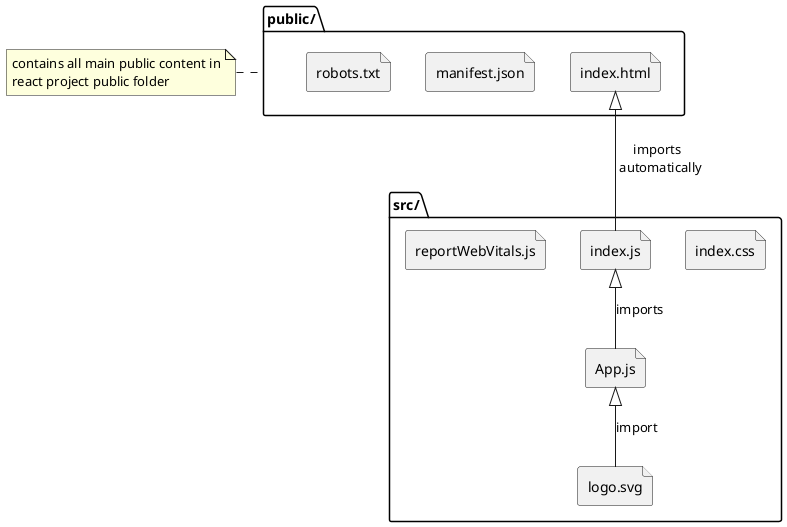

# Ecommerce Udemy Course - Django and React

[TOC levels=2]: # "## Table of contents"

## Initial setup/configuration

Details on setting up local machine, including PyCharm, etc. for this course.

1. Create empty github repo
2. Clone newly created github repo in PyCharm
3. In PyCharm project, setup a venv for the project.
4. Add README.md and gitignore files to the repo and commit/push.

7/25 Steps:

1. Created Django Project using PyCharm with ap named proshop.
2. Created new github repo by doing a VCS->Share on github, which created a new gh repo.
3. Created new React project named frontend in PyCharm outside of djangoProject. Used Windows version of node and
   npm/npx.
4. Tested and confirmed React app, closed PyCharm project and ran react within djangoProject.

## Create Django Project in PyCharm

Created Django Python project in PyCharm with an application named proshop. Project name is djangoProject. Once created
the project was shared on github (i.e. a new github repo was created)

## Create React Project Using PyCharm Wizard and Windows node and npm/npx modules

In PyCharm a new React project was created (outside of the djangoProject) using the Windows version of node and npm/npx.
Using the WSL versions had 2 issues. The first was that the startup was slow and secondly, changes were not
automatically refreshed. I suspect that using babel and/or nodemon would help with that as WSL/Linux versions of the
node server on Windows are picking up real time changes to files.

Closed React project, opened frontend/packages.json file and choose "start" to run the React server to test locally.  
Once running, real time changes to the React app were working.

## Starting the Front End - React

Prior to using PyCharm Project wizard to create React app, used WSL versions of node and npm/npx to create the React
application using the below steps. Due to issues with speed and making live changes, I used the steps noted above using
the PyCharm project wizard to create the react app using the Windows versions of node and npm/npx.

### Step 1 - Run npx command to create the react app.

Run the following command to create the react app in the root project folder.

`npx create-react-app frontend`

This adds a new folder called frontend/

This can be tested/confirmed by starting up the react frontend server.

In the frontend/packages.json file, there are npm commands that are defined. These can be used as a starting point to
add a PyCharm run configuration. Note that usually the node command needs to be found and added (e.g. I used WSL and add
/usr/bin/node). At this point, there should be a Run option called "start". Starting this will startup the react server
and open the page (note, this takes a bit to startup).

```
cd frontend;
npm start;
```

Output from npx command.

```
Success! Created frontend at /mnt/c/Users/david/Dropbox/Programming/Python/PyCharmProjects/django-react-ecommerce-course/frontend
Inside that directory, you can run several commands:

  npm start
    Starts the development server.

  npm run build
    Bundles the app into static files for production.

  npm test
    Starts the test runner.

  npm run eject
    Removes this tool and copies build dependencies, configuration files
    and scripts into the app directory. If you do this, you can’t go back!

We suggest that you begin by typing:

  cd frontend
  npm start

```

### Section 2: Starting the Front End - Cleanup frontend react components

Make updates to App.js, etc.

1. Copy resources/ folder from downloaded github repo to Django project.
2. Replace the favicon.ico in public/ with newly added resources/favicon.ico.
3. In index.html remove link to Learn React as well as the spinning icon.
4. From the src/ folder we can remove App.css, setupTests.js and App.test.js files. 

### React-Bootstrap setup, header and footer components


## Backend Setup

### DJango

### AWS

## Database

### Postgres

## Reference, Resources and Diagrams

Diagram




