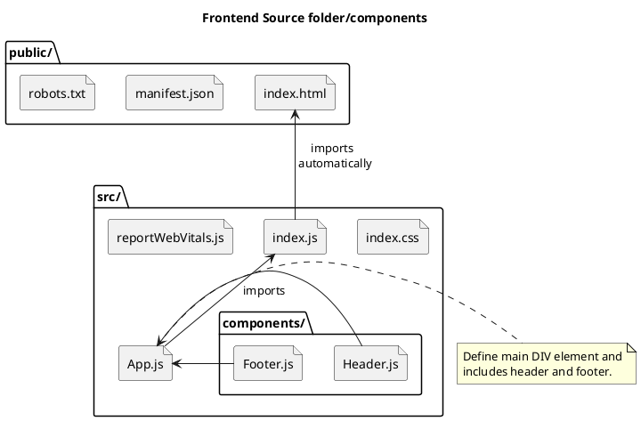

Ecommerce Udemy Course - Django and React
===

## Table of Contents

[TOC]

## Initial setup/configuration

Details on setting up local machine, including PyCharm, etc. for this course.

1. Create empty github repo at [djangoProject Github Repo](https://github.com/DavidHartman-Personal/djangoProject)
2. Clone newly created github repo in PyCharm
3. In PyCharm project, setup a venv for the project.
4. Add README.md and gitignore files to the repo and commit/push.

7/25 Steps:

1. Created Django Project using PyCharm with ap named proshop.
2. Created new github repo by doing a VCS->Share on github, which created a new gh repo.
3. Created new React project named frontend in PyCharm outside of djangoProject. Used Windows version of node and
   npm/npx.
4. Tested and confirmed React app, closed PyCharm project and ran react within djangoProject.

### Project File/Folder Structure

The below sections show the various files and folders related to this project/course.  The current project is not 

#### Django Framework Files/Folders

Files/Folders that are specific to the Django Framework.

| Name                         | Description                                                                                                                                           |
|:---------------------------- |:----------------------------------------------------------------------------------------------------------------------------------------------------- |
| djangoProject/               | Project Main folder                                                                                                                                   |
| djangoProject/djangoProject/ | The Django App folder.  This is created when creating a new Django project and providing and App Name.                                                |
| djangoProject/documentation/ | Contains documentation, including PlantUML files, etc.                                                                                                |
| djangoProject/frontend/      | React Frontend folder, created with `npm create-react-app` command. See [Create React app](#Starting-the-Front-End---React) below                     |
| djangoProject/proshop/       | This was created by the ???                                                                                                                        df |
| djangoProject/resources/     | Contains resources that were imported from the original project.  This includes images, data structures, etc. used for testing, etc.                  |

#### React Framework Files/Folders

These Files/Folders were created by running the `npm create-react-app` command. See [Starting the Front End](#Starting-the-Front-End---React) below.

| Name                    | Description                                                                                 |
|:----------------------- |:------------------------------------------------------------------------------------------- |
| frontend/               | Project Main folder                                                                         |
| frontend/node_modules/  | Created when running the npm command to create react application.                           |
| frontend/public/        | Folder container the public object as part of the front end                                 |
| frontend/src/           | Main source code folder for the react front end.                                            |
| frontend/src/components | Contains shared components used across most pages.  E.g. Footer.js, etc.                    |
| frontend/src/screens    | Contains the main core pages that make up the front end.  E.g. Cart.js, HomeScreen.js, etc. |
|                         |                                                                                             |

## Create Django Project in PyCharm

Created Django Python project in PyCharm with an application named proshop. Project name is djangoProject. Once created
the project was shared on github (i.e. a new github repo was created)

## Create React Project Using PyCharm Wizard and Windows node and npm/npx modules

In PyCharm a new React project was created (outside of the djangoProject) using the Windows version of node and npm/npx.
Using the WSL versions had 2 issues. The first was that the startup was slow and secondly, changes were not
automatically refreshed. I suspect that using babel and/or nodemon would help with that as WSL/Linux versions of the
node server on Windows are picking up real time changes to files.

Closed React project, opened frontend/packages.json file and choose "start" to run the React server to test locally.  
Once running, real time changes to the React app were working.

## Building the Front End - React

Prior to using PyCharm Project wizard to create React app, used WSL versions of node and npm/npx to create the React
application using the below steps. Due to issues with speed and making live changes, I used the steps noted above using
the PyCharm project wizard to create the react app using the Windows versions of node and npm/npx.

[Run npx command to create the react app](#Step 1 - Run npx command to create the react app)

### Step 1 - Run npx command to create the react app.

Run the following command to create the react app in the root project folder.

`npx create-react-app frontend`

This adds a new folder called frontend/

This can be tested/confirmed by starting up the react frontend server.

In the frontend/packages.json file, there are npm commands that are defined. These can be used as a starting point to
add a PyCharm run configuration. Note that usually the node command needs to be found and added (e.g. I used WSL and add
/usr/bin/node). At this point, there should be a Run option called "start". Starting this will startup the react server
and open the page (note, this takes a bit to startup).

```
cd frontend;
npm start;
```

Output from npx command.

```
Success! Created frontend at /mnt/c/Users/david/Dropbox/Programming/Python/PyCharmProjects/django-react-ecommerce-course/frontend
Inside that directory, you can run several commands:

  npm start
    Starts the development server.

  npm run build
    Bundles the app into static files for production.

  npm test
    Starts the test runner.

  npm run eject
    Removes this tool and copies build dependencies, configuration files
    and scripts into the app directory. If you do this, you can’t go back!

We suggest that you begin by typing:

  cd frontend
  npm start

```

### Section 2: Starting the Front End - Cleanup frontend react components

Make updates to App.js, etc.

1. Copy resources/ folder from downloaded github repo to Django project.
2. Replace the favicon.ico in public/ with newly added resources/favicon.ico.
3. In index.html remove link to Learn React as well as the spinning icon.
4. From the src/ folder we can remove App.css, setupTests.js and App.test.js files.

### React-Bootstrap setup, header and footer components

Added components/Header.js and components/Footer.js and then import them into App.js

Import bootstrap from bootswatch.com to get style related components.

Download the bootstrap.min css file for Lux type from bootswatch and add to our src/ frontend folder.

Use npm install to add boot strap.

`npm install react-boostrap`
NOTE: Had to restart PyCharm due to 404 error

Component descriptions and code for react-bootstrap theme can be found
at [react-bootstrap](https://react-bootstrap.github.)
io/components/alerts

Add link to font-awesome from [cdnjs](https://cdnjs.com/) by searching for font-awesome and copying the link. This gives
us access to icons, etc. with the css file. For Font Awesome, adding an icon is done by adding the `<i>` tag with a
class name attribute. The classes for an icon require 2 entries. The first is for the style (solid, regular, Brands,
etc.) and the other for the icon name.  
So to add the shopping icon in the solid style we would add the following:

`<i className="fas fa-shopping-cart"></i>`

NOTE: fas is shorthand for fa-solid.

Add a shopping cart and user icons for the Navbar Cart and Login entries.

```htmlembedded

<Navbar.Collapse id="basic-navbar-nav">
    <Nav className="mr-auto">
        <Nav.Link href="/cart"><i className={"fas fa-shopping-cart"}></i>Cart</Nav.Link>
        <Nav.Link href="/login"><i className={"fas fa-user"}></i>Login</Nav.Link>
    </Nav>
</Navbar.Collapse>
```
The above React code would generate HTMl as follows:

```htmlembedded
<div class="navbar-collapse collapse" id="basic-navbar-nav">
    <div class="mr-auto navbar-nav">
        <a href="/cart" data-rr-ui-event-key="/cart" class="nav-link">
            <i class="fas fa-shopping-cart"></i>
            Cart
        </a>
        <a href="/login" data-rr-ui-event-key="/login" class="nav-link">
            <i class="fas fa-user"></i>
            Login
        </a>
    </div>
</div>
```
The below diagram represents the navigration bar that was added.

```plantuml
@startsalt
{
  {/ <b>ProShop | Cart | Login }
  '^ProShop^
}
@endsalt
```



### Section 2.7 - Home Screen Product Listing

Until we get the actual database linked into the project, we will use some dummy data that is accessed via a js constant array defined in the products.js file.

Copy products.js file to the frontend/src/ folder.  This contains a Object (JSON) js object that defines the products and their attributes.
Below is an example snippet of the product definitions:

```jsonld
const products = [
  {
    '_id': '1',
    'name': 'Airpods Wireless Bluetooth Headphones',
    'image': '/images/airpods.jpg',
    'description':
      'Bluetooth technology lets you connect it with compatible devices wirelessly High-quality AAC audio offers immersive listening experience Built-in microphone allows you to take calls while working',
    'brand': 'Apple',
    'category': 'Electronics',
    'price': 89.99,
    'countInStock': 10,
    'rating': 4.5,
    'numReviews': 12,
  },
    ...
]
```

The images folder contained in the course resources contains the sample product images defined in the products.js file.  Links to these images are defined in the product definition.

This images folder should be copied to public/images/.

#### Create HomeScreen Page

Create frontend/src/screens folder.  This will contain the various screens within the application.

Add HomeScreen.js where the main landing page/screen will be defined.  It will list the current products in a React-bootstrap grid system.  It will loop through all of the products defined in Products.js and print out information about the products.

The code for the HomeScreen page is stored in src/screens/HomeScreen.js.  This page includes a Listing of the current products being offered. We import the products constant (See Above) that is an array of objects.  The products.map function will apply a function for each object in the array.  
Using the [Layout Grid react-boostrap](https://react-bootstrap.github.io/layout/grid/.) we can add Rows and Columns to our page.

In our case, that function will create a Column entry for each element of the product object that is to be displayed.  There is as single row created and then for each entry in the products array a named arrow function will be performed.  The name of the arrow function can be referenced within the function.  So 

Column (not a row) is added.

```javascript
import React from 'react';
import { Row, Col } from 'react-bootstrap'
import products from '../products'
/**
 * We're using the Row and Col components from the react-bootstrap library to create a grid of products
 * @param props - This is the props object that is passed to the component.
 * @returns A div with a h1 and a row.
 */
function HomeScreen(props) {
    return (
        <div>
            <h1>Latest Products</h1>
            <Row>
                {products.map(product => (
                   <Col key={product._id} sm={12} md={6} lg={4} xl={3}>
                       <h3>{product.name}</h3>
                   </Col>
                ))}
            </Row>
        </div>
    );
}
export default HomeScreen;
```
#### Create Product Component

Next we create a new Component for our React Frontend app that will manage individual Products.  Since this component may be used in other areas within our application it gets created in the src/components/ folder.  This will then replace the products.map step created in the previous step.

The Product component will use the [react-boostrap a Card component](https://react-bootstrap.github.io/components/cards/). To create individual cards for each Product.  We create a exported function for Product that will return a Card.  This Card will have classes added that handle margins, padding, shape, etc.

To create a Card, we add a Card and include classes to modify it.  The modifier classes are the following:
my-3: This adds a margin of 3
p-3: This adds a padding amount of 3
rounded: This makes the card have slightly rounded corners.

Below is the Product component definition.  
```javascript
import React from 'react';
import { Card } from 'react-bootstrap'

function Product(props) {
    return (
        <Card className={"my-3 p-3 rounded"}>Product detail</Card>
    );
}

export default Product;
```
The HomeScreen screen is updated to import Product and update the map code to call the Product function for each entry in the products array.
The HomeScreen function in src/screens/HomeScreen.js should be updated to reference the newly created Product component.

```json
function HomeScreen(props) {
    return (
        <div>
            <h1>Latest Products</h1>
            <Row>
                {products.map(product => (
                   <Col key={product._id} sm={12} md={6} lg={4} xl={3}>
                       <Product product={product}
                   </Col>
                ))}
            </Row>
        </div>
    );
}
```

#### Add Product Screen/Page and Update Product Component to link to Product Screen/Page

Update the Product function in src/components/Product.js to create a link to the Product screen (not the Product component).  The props variable in the Product function should pass in the product object to be used in an HREF tag.  The created link should link to a product screen (not yet created) including a reference to the product._id.  The link is attached to a Card.Img component of the Card objectg.  This is similar to using the  tag in HTML.  The source will reference the image in the images folder, located in public/images/.  E.g. the first entry in the products array is defined as and the image key contains images/airpods.jpg, which is used as the source for the image:

```json
const products = \[  
  {  
    '_id': '1',  
    'name': 'Airpods Wireless Bluetooth Headphones',  
    'image': '/images/airpods.jpg',  
    'description':  
   'Bluetooth technology lets you connect it with compatible devices wirelessly High-quality AAC audio offers immersive listening experience Built-in microphone allows you to take calls while working',  
    'brand': 'Apple',  
    'category': 'Electronics',  
    'price': 89.99,  
    'countInStock': 10,  
    'rating': 4.5,  
    'numReviews': 12,  
  }
```

The updated Product function in src/components/Product.js should look as follows:

```jsx
/**
 * It returns a Card component with the className prop set to "my-3 p-3 rounded" and the children set to "Product"
 * @param props - This is the object that contains all the properties that were passed to the component.
 * @returns A Card component with the className of "my-3 p-3 rounded" and the text "Product"
 */
function Product({ product }) {
    return (
        <Card className={"my-3 p-3 rounded"}>
            <a href={`/product/${product._id}`}>
                <Card.Img src={product.image} />
            </a>
        </Card>
    );
}
```

Note that the backticks in the href link allow for variable substitution.  In this case we are adding the product._id value to the generated HTML.

This genarates the following HTML in the page:
```htmlembedded
<div class="col-xl-3 col-lg-4 col-md-6 col-sm-12">
    <div class="my-3 p-3 rounded card">
        <a href="/product/1">
            
        </a>
    </div>
</div>
```

Now the HomeScreen should appear as follows:


Next Update the Product function to include more details about the product, including the Product name, product image and ratings information.  The updated function creates a React Card Object.

Add an Image as part of the Cards definition.

```htmlembedded
<a href={`/product/${product._id}`}>
  <Card.Img src={product.image} />
</a>
```

Add to the Card Body the title of the Product including a HREF link to the product detail page (not yet created).

```htmlembedded
<a href={`/product/${product._id}`}>
  <Card.Title as={"div"}>
    <strong>{product.name}</strong>
  </Card.Title>
</a>
```

Next add a Card Text component that includes the Review rating information.

```htmlembedded
<Card.Text as={"div"}>
  <div className={"my-3"}>
   {product.rating} from {product.numReviews} reviews
  </div>
</Card.Text>
```

Add a Text Component to the Card that includes the products price.  This Card.Text component should be created as an h3 type so that is stands out from the other text.

```htmlembedded
<Card.Text as={"h3"}>
  ${product.price}
</Card.Text>
```
<a name="originalproductfunction">
The full updated Product function should be as follows:
```javascript=
 * It returns a Card component with the className prop set to "my-3 p-3 rounded" and the children set to "Product"
 * @param props - This is the object that contains all the properties that were passed to the component.
 * @returns A Card component with the className of "my-3 p-3 rounded" and the text "Product"
 */
function Product({ product }) {
    return (
        <Card className={"my-3 p-3 rounded"}>
            <a href={`/product/${product._id}`}>
                <Card.Img src={product.image} />
            </a>
            <Card.Body>
                <a href={`/product/${product._id}`}>
                    <Card.Title as={"div"}>
                        <strong>{product.name}</strong>
                    </Card.Title>
                </a>
                <Card.Text as={"div"}>
                    <div className={"my-3"}>
                        {product.rating} from {product.numReviews} reviews
                    </div>
                </Card.Text>
            </Card.Body>
        </Card>
    );
}
```
</a>

### Section 2.8 - Add the Rating Component for Products

This is section 2.8 where the rating components are added.  Within the Product.js page, we will add a componment within the Card.Text that will add the yet to be created Rating component.  

Within the Card.Text replace the line that printed the ratings with a new line to call the Rating Compomnent.  The Rating component adds the value equal to the product.rating as well as a text string to prints the number of reviews.  Additionally, we pass in a color which will be used to color the stars.  The hex value f8e825 is a shade of yellow.
The below snippet is included in the Product.js file.

```javascript
<Card.Text as={"div"}>
  <div className={"my-3"}>
  <Rating value={product.rating} text={`${product.numReviews} reviews`} color={'#f8e825'} />
</div>
</Card.Text>
```

Next we import the Rating component into the Product component.  Within the Rating.js script we export a function and the function should accept value, text and color as inputs.  The Rating function returns a DIV that has a className of 'rating'.  Within this DIV we will now add 5 stars that will be colored yellow based on logic added to the tags.  A SPAN block is created with an I styled tag added that will display font awesome icons for stars.  See above for the icons for Cart and Login where we used these font awesome icons previously.  The star will either be empty, fully colored or only half colored.  Within the I tag, the className will be determined based on if-then-else logic.  
The logic will add a full start if the value is >= to a whole number, a half star if the number is >= half of the previous whole number, otherwise an empty start will be added.
The I tag className logic will look as follows:

```javascript=
className={
    value >= 1
        ? 'fas fa-star'
        : value >= .5
           ? 'fas fa-star-half-alt'
           : 'far fa-star'
}
```

This logic is repeated with a span tag for each whole number up to 5 stars.  The final Rating function is as follows:

```javascript=
function Rating({value, text, color}) {
    return (
        <div className={"rating"}>
            <span>
              <i style={{color}} className={
                  value >= 1
                      ? 'fas fa-star'
                      : value >= .5
                          ? 'fas fa-star-half-alt'
                          : 'far fa-star'
              }>

              </i>
            </span>
            <span>
              <i style={{color}} className={
                  value >= 2
                      ? 'fas fa-star'
                      : value >= 1.5
                          ? 'fas fa-star-half-alt'
                          : 'far fa-star'
              }>

              </i>
            </span>
            <span>
              <i style={{color}} className={
                  value >= 3
                      ? 'fas fa-star'
                      : value >= 2.5
                          ? 'fas fa-star-half-alt'
                          : 'far fa-star'
              }>

              </i>
            </span>
            <span>
              <i style={{color}} className={
                  value >= 4
                      ? 'fas fa-star'
                      : value >= 3.5
                          ? 'fas fa-star-half-alt'
                          : 'far fa-star'
              }>

              </i>
            </span>
            <span>
              <i style={{color}} className={
                  value >= 5
                      ? 'fas fa-star'
                      : value >= 4.5
                          ? 'fas fa-star-half-alt'
                          : 'far fa-star'
              }>

              </i>
            </span>


        </div>
    );
}
```

The following line in Product.js file is removed.

```javascript=
{product.rating} from {product.numReviews} reviews
```

Next we include a final SPAN tag in Ratings.js file with the numeric value for the Rating as such.  The logic within this tag will include the text passed to the function if the value is non-null.

```htmlembedded=
<span>{text && text}</span>
```

Once this is included in the Rating.js file we will upate the main CSS file.  The logic implemented would modify the class rating (defined via `<div className={"rating"}>`) so that any SPAN tag has some margins added.  This will modify the look of the stars and the rating count within the Product card.

We also will adjust the spacing/margins of the h3 tags for all pages within the application.
    
The updates to the index.css file will look as follows:

```htmlembedded=
h3 {
    padding:1rem 0;
}
.rating span{
 margin:0.1rem;
}
```

### Section 2.9 - Implement the React Router

The following steps are completed as part of this lesson:
1. Install the react-router-dom and react-router-bootstrap packages in the frontend/ folder.
2. Import a Router, Routes and Route modules into the App.js function.
3. Replace the HomeScreen/ tag within the Container HTML tag to use a Route with a path of "/"
4. Create a ProductScreen.js file and logic and add new Route to App.js
5. Update the Product.js component to use React router Links instead of HTML anchor tags.
6. Update any other HREF links to use react Links

#### Install the react-router-dom and react-router-bootstrap packages in the frontend/ folder.
In the frontend/ folder, install the react-router-dom and react-router-bootstrap packages via npm as follows:

`npm install react-router-dom react-router-bootstrap`

#### Import a Router, Routes and Route modules into the App.js function.
Next we import BrowserRouter and Route from the react-router-dom package.

```javascript=
import {BrowserRouter as Router, Routes, Route} from 'react-router-dom'
```

#### Replace the HomeScreen/ tag within the Container HTML tag to use a Route with a path of "/"
Once added, we can replace the outer DIV tag within the return with a call to Router.  Additionally, we can replace any calls we had to other externally defined objects (e.g. HomeScreen) with a call to Route, passing in the component name.  Adding the "exact" keyword makes this Route definition only applicable to the current page.
Note that the syntax/usage differs from the videos as noted in one of the Q&A items.  The Q&A item suggests to import HashRouter instead of BrowserRouter and also imports Routes.  

So the updated App.js function looks as follows:

```htmlembedded=
<Router>
            <Header/>
            <main className={"py-3"}>
                <Container>
                    <Routes>
                        {" "}
                        <Route path="/" element={<HomeScreen/>}/>
                    </Routes>
                </Container>

            </main>
            <Footer/>
        </Router>
```
#### Create a ProductScreen.js file and logic and add new Route to App.js
Create src/screens/ProductScreen.js file and just print "Product" with a Div tag.


Next update App.js to include a new route for the ProductScreen.  Note that the Route call does not include exat as the URL will be dynamically genreated to include the Product Id.

```htmlembedded=
<Route path="/product/:id" element={<ProductScreen/>}/>
```

Adding this new Route and clicking on Product with an id of 1 will will direct traffic to http://localhost:3000/product/1 

#### Update the Product.js component to use React router Links instead of HTML anchor tags.

With the current logic in Product.js the HTML HREF to create link to a product detail page.  The preferred method is to replace these HREF links with React Router DOM Links.  This also will speed up the loading of the page as the browser does not load a new page, but just adds a new React component.

The original product compoment can be seen above in Section 2.7 - Home Screen Product Listing where the Product.js is initially created.

The src/components/Product.js will change to the following this:

```javascript=
import React from 'react';
import {Card} from 'react-bootstrap'
import {Link} from 'react-router-dom'
import Rating from './Rating'

/**
 * It returns a Card component with the className prop set to "my-3 p-3 rounded" and the children set to "Product"
 * @param props - This is the object that contains all the properties that were passed to the component.
 * @returns A Card component with the className of "my-3 p-3 rounded" and the text "Product"
 */
function Product({product}) {
    return (
        <Card className={"my-3 p-3 rounded"}>
            <Link to={`/product/${product._id}`}>
                <Card.Img src={product.image}/>
            </Link>
            <Card.Body>
                <Link to={`/product/${product._id}`}>
                    <Card.Title as={"div"}>
                        <strong>{product.name}</strong>
                    </Card.Title>
                </Link>
                <Card.Text as={"div"}>
                    <div className={"my-3"}>
                        <Rating value={`${product.rating}`} text={`${product.numReviews} reviews`} color={'#f8e825'} />
                    </div>
                </Card.Text>
                <Card.Text as={"h3"}>
                    ${product.price}
                </Card.Text>
            </Card.Body>
        </Card>
    );
}

export default Product;
```

#### Update any other HREF links to use react Links

In the previous section we replace HREF links to other pages within the app to use React router established routes and Link elements.  This included importing Link from react-router-dom.  Next we want to replace other HREF links that may not link to a defined React route.  For example, the main page logo has an HREF that simply redirects back to the home page.  

The Header.js component should be updated to use LinkContainers from react-router-bootstrap as below:

```javascript=
import React from 'react'
import {Navbar, Nav, Container} from 'react-bootstrap'
import {LinkContainer} from 'react-router-bootstrap'

function Header() {
    return (
        <header>
            <Navbar bg="dark" variant="dark" expand="lg" collapseOnSelect>
                <Container>
                    <LinkContainer to={"/"}>
                        <Navbar.Brand>ProShop</Navbar.Brand>
                    </LinkContainer>
                    <Navbar.Toggle aria-controls="basic-navbar-nav"/>
                    <Navbar.Collapse id="basic-navbar-nav">
                        <Nav className="mr-auto">
                            <LinkContainer to={"/cart"}>
                                <Nav.Link><i className={"fas fa-shopping-cart"}></i>Cart</Nav.Link>
                            </LinkContainer>
                            <LinkContainer to={"/login"}>
                                <Nav.Link><i className={"fas fa-user"}></i>Login</Nav.Link>
                            </LinkContainer>
                        </Nav>
                    </Navbar.Collapse>
                </Container>
            </Navbar>
        </header>
    )
}

export default Header
```

### Section 2.10 - Product Details Screen

This section will focus on building out the Product detail page.  This includes importing/using React router DOM and React Bootstrap components within the Product detail page.

1. Import react-router-dom, react-boostrap, Rating componment and the Products array
2. Create constant that will contain the specific product from the imported array
3. Create/Add detailed elements on Product detailed page

#### Import react-router-dom, react-boostrap, Rating componment and the Products array

Add imports to ProductScreen.js as below:

```javascript=
import { Link, UseParams } from 'react-router-dom'
import { Row, Col, Image, ListGroup, Button, Card } from 'react-bootstrap'
import Rating from '../components/Rating'
import products from '../products'
```

NOTE: The UseParams was needed for the latest react-router-dom module.  Previously, this was not imported/used.

#### Create constant that will contain the specific product from the imported array

When the route for the ProductScreen was defined on the main App.js page, the path included a parameter to be passed to the component.  This was named id.

```javascript=
<Route path="/product/:id" element={<ProductScreen />} />
```
This id can be accessed within the function by accessing the params that were passed in.

```javascript=
function ProductScreen() {
    const match = useParams();
    const product = products.find((p) => p._id == match.id);
    return (
        <div>
            {product.name}
        </div>
    );
}
```

#### Create/Add detailed elements on Product detailed page

This step involves adding the various JavaScript/HTML elements for the Product detail page.  The Product Detail page will have the following items.

- Link to Go Back to the main/home Page
- A single Row Element containing 3 Column elements.
- Column 1 will be an image of the Product
- Column 2 will contain a ListGroup with 4 Items: Product Image, product name, price and rating information
- Column 3 will contain a Card element that will list the Price, The inventory Status and include an Add to Cart button.

Add a Link object to the Product detail page that is styled as a button and has a margin of 3 by adding the following:

```javascript
<Link to='/' className='btn btn-light my-3'>Go Back</Link>
```

The next element is a Row Element containing 3 Columns of information about the Product.

Column 1 is an image of the product, which is located in the product.image value of the Product elements.  E.g. the iPhone 11 product has an image value of 'image': '/images/phone.jpg'.  Not sure what the fluid setting does.  

```javascript
<Col md={6}>
    <Image src={product.image} alt={product.name} fluid />
</Col>
```

The second Column contains details about the product wich is contained in a ListGroup Element.  The first ListGroup item is the name of the Product.

```javascript
<Col md={3}>
   <ListGroup variant={"flush"}>
    <ListGroup.Item>
     <h3>{product.name}</h3>
    </ListGroup.Item>
   </ListGroup>
</Col>
```
The second ListGroup item includes the Rating details.  This is added by importing the Rating component that was created previously.

```javascript
<ListGroup.Item>
  <Rating value={product.rating} text={`${product.numReviews} ratings`} color={'#f8e825'}/>
</ListGroup.Item>
```
Next the Price is added.
```javascript
<ListGroup.Item>
  Price: ${product.price}
</ListGroup.Item>
```

The final element in the ListGroup is a description of the Product.
```javascript
<ListGroup.Item>
  Description: {product.description}
</ListGroup.Item>
```

The 3rd column will include the Price, the inventory status (In Stock vs Out of Stock) and an Add to Cart button. This will be done by adding a Card element that contains a ListGroup Item in the ListGroup is a single Row Element with 2 Column Elements. 
The first ListGroup item will show the price of the product.

```javascript
<ListGroup.Item>
 <Row>
  <Col>Price:</Col>
  <Col>
   <strong>${product.price}</strong>
  </Col>
 </Row>
</ListGroup.Item>
```

Next the inventory status is displayed that includes logic based off of the countInStock attribute of the product (See the Products.js file).  If the countInStock is greater than 0 then "In Stock" should be displayed, otherwise "Out of Stock" should be displayed.

```javascript
<ListGroup.Item>
 <Row>
  <Col>Status:</Col>
  <Col>
     {product.countInStock > 0 ? 'In Stock' : 'Out of Stock'}
  </Col>
 </Row>
</ListGroup.Item>
```
This can be confirmed by updating the countInStock value to 0 for an item in the Products.js file and then going to that products detail page.  

The final ListGroup item will be a button that is as wide as the previous ListGroup items, each of which included a Row with 2 Columns.  We use the imported Button element to create the button. The button should also be disabled if the countInStock is 0.  This is done by adding the disabled flag and settings is value to the boolean check of countInStock being equal to 0.

```javascript
<ListGroup.Item>
 <Row>
   <Button className={'btn-block'} disabled={product.countInStock == 0} type='button'>Add to Cart</Button>
 </Row>
</ListGroup.Item>
```

This completes the setup of the Front end, including the react components.  

## Backend Setup


### DJango

### AWS

## Database

### Postgres

## Reference, Resources and Diagrams




###### tags: `Django React Ecommerce Course - Udemy` `Readme` `Documentation` `Django` `Python` `Web Application` `React`
    